# Лабораторная работа 2: Kubernetes (базовый-трек)

## Ход выполнения

### Part 1:

Перед началом выполнения работы я установила `Docker`, `kubectl`, `Minikube` и `Helm` (последний понадобится во второй части). Проверила версии всех скачанных инструментов:

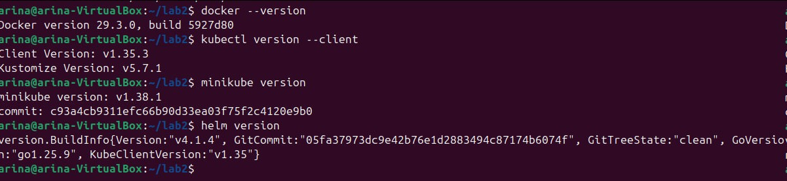

Дальше я запустила локальный кластер с помощью команды `minikube start --driver=docker`:

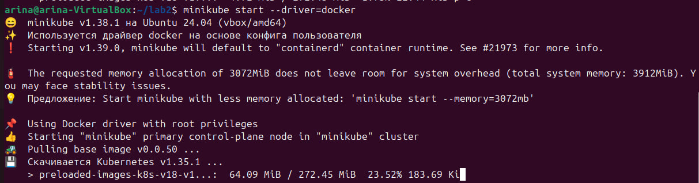

Проверила, что нода кластера готова к работе командой `kubectl get nodes` — статус `Ready`:

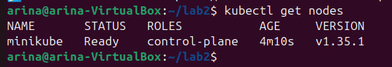

После этого я создала структуру проекта (папки `lab2/app` для исходников приложения и `lab2/k8s` для манифестов Kubernetes) и написала простой сервис на Flask, который выводит «Hello from Kubernetes!» и имя пода, на который попал запрос:

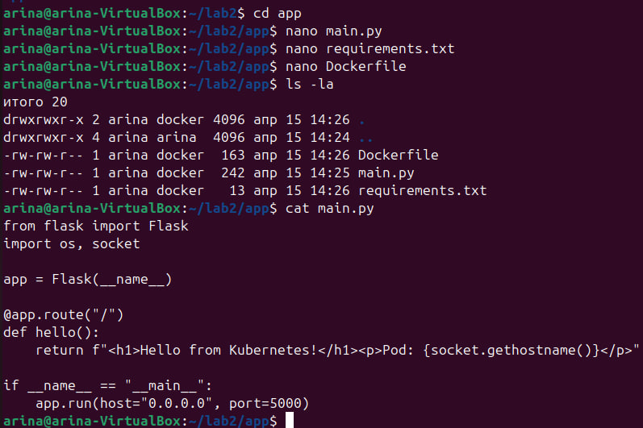

`main.py`:
```python
from flask import Flask
import os, socket

app = Flask(__name__)

@app.route("/")
def hello():
    return f"<h1>Hello from Kubernetes!</h1><p>Pod: {socket.gethostname()}</p>"

if __name__ == "__main__":
    app.run(host="0.0.0.0", port=5000)
```

Дальше я собрала Docker-образ **внутри docker-демона minikube**, чтобы кластер мог его подтянуть локально без обращения к DockerHub. Для этого сначала переключила окружение командой `eval $(minikube docker-env)`, а потом собрала образ:

```bash
eval $(minikube docker-env)
docker build -t hello-k8s:v1 ./app
```

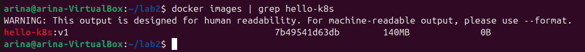

Дальше я создала папку `k8s/` и три манифеста — использовала 3 ресурса Kubernetes: **Namespace**, **Deployment** и **Service**.

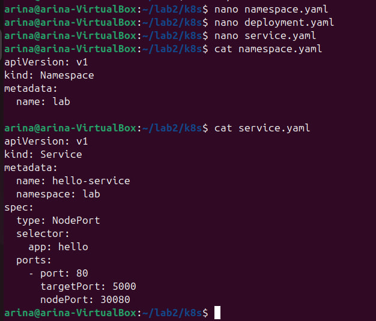

`namespace.yaml`:
```yaml
apiVersion: v1
kind: Namespace
metadata:
  name: lab
```

`deployment.yaml`:
```yaml
apiVersion: apps/v1
kind: Deployment
metadata:
  name: hello-deployment
  namespace: lab
spec:
  replicas: 2
  selector:
    matchLabels:
      app: hello
  template:
    metadata:
      labels:
        app: hello
    spec:
      containers:
        - name: hello
          image: hello-k8s:v1
          imagePullPolicy: IfNotPresent
          ports:
            - containerPort: 5000
```

`service.yaml`:
```yaml
apiVersion: v1
kind: Service
metadata:
  name: hello-service
  namespace: lab
spec:
  type: NodePort
  selector:
    app: hello
  ports:
    - port: 80
      targetPort: 5000
      nodePort: 30080
```

- **Namespace**: изолированное пространство имён, в котором живут ресурсы (аналог отдельной папки)
- **Deployment**: управляет набором Pod'ов, обеспечивает нужное количество реплик и rolling update при обновлениях
- **Service**: даёт стабильную точку входа к приложению, даже если Pod'ы пересоздаются (тип `NodePort` пробрасывает порт наружу через ноду кластера)

Чтобы задеплоить всё одной командой, я использовала `kubectl apply -f k8s/`:

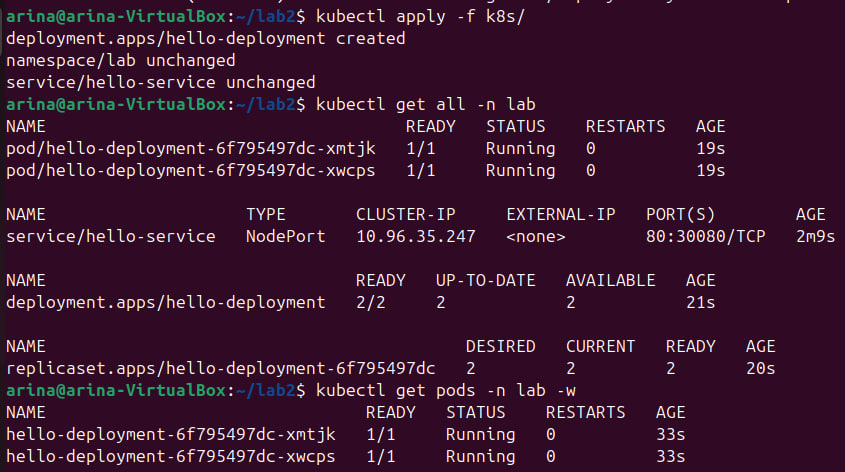

И проверила, что приложение работает — открыла адрес сервиса в браузере командой `minikube service hello-service -n lab`. Страничка отдаётся, видно имя пода, который ответил на запрос:

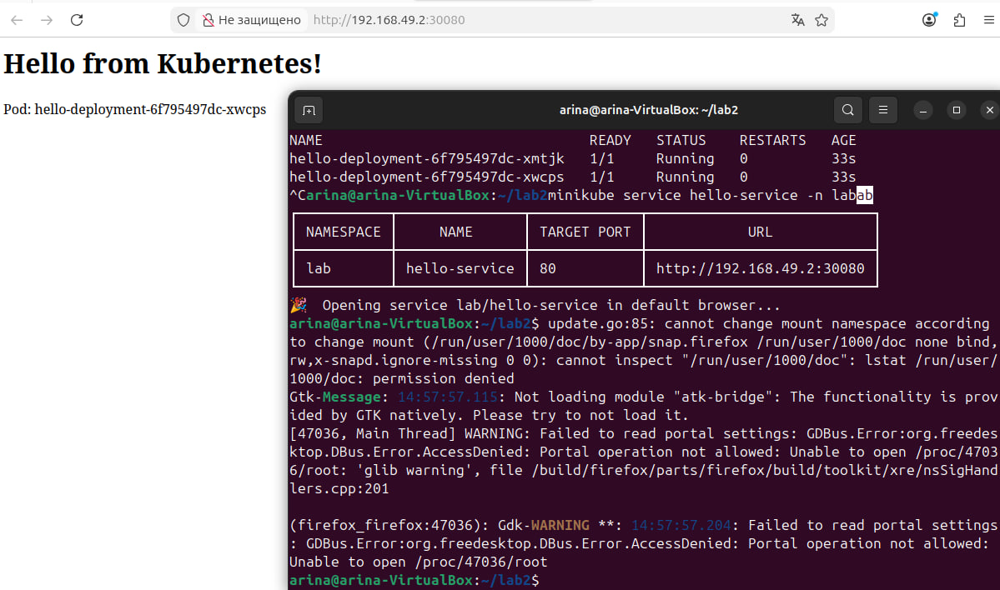

### Part 2:

Для второй части лабораторной я уже скачала Helm заранее (см. скрин с проверкой версий в начале отчёта — ставила по официальной инструкции с https://helm.sh/docs/intro/install/). С помощью `helm create hello-chart` создала новый chart с готовой структурой файлов:

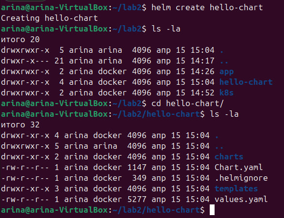

Дальше я отредактировала `values.yaml` под свой сервис — вынесла туда количество реплик, репозиторий и тег образа, тип сервиса и порт:

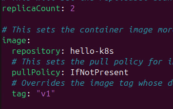

`values.yaml` (ключевые поля):
```yaml
replicaCount: 2

image:
  repository: hello-k8s
  pullPolicy: IfNotPresent
  tag: "v1"

service:
  type: NodePort
  port: 80
  nodePort: 30080

ingress:
  enabled: false
autoscaling:
  enabled: false
```

После этого подправила сгенерированные шаблоны `templates/deployment.yaml` и `templates/service.yaml` — указала `containerPort: 5000` (порт, на котором слушает Flask) и `nodePort: 30080` в сервисе:

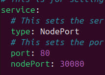

Перед установкой проверила, что чарт валидный и Helm корректно генерирует манифесты:

```bash
helm lint hello-chart
helm template hello-chart
```

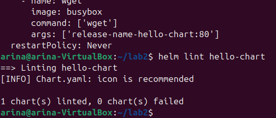

Перед установкой нового релиза снесла ресурсы из первой части командой `kubectl delete -f k8s/`, чтобы не было конфликта по `nodePort`:

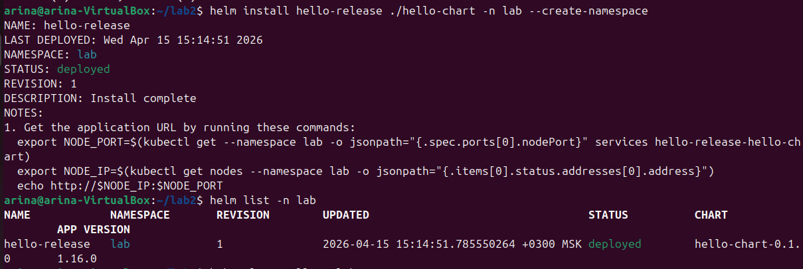

Установила chart в кластер:

```bash
helm install hello-release ./hello-chart -n lab --create-namespace
```

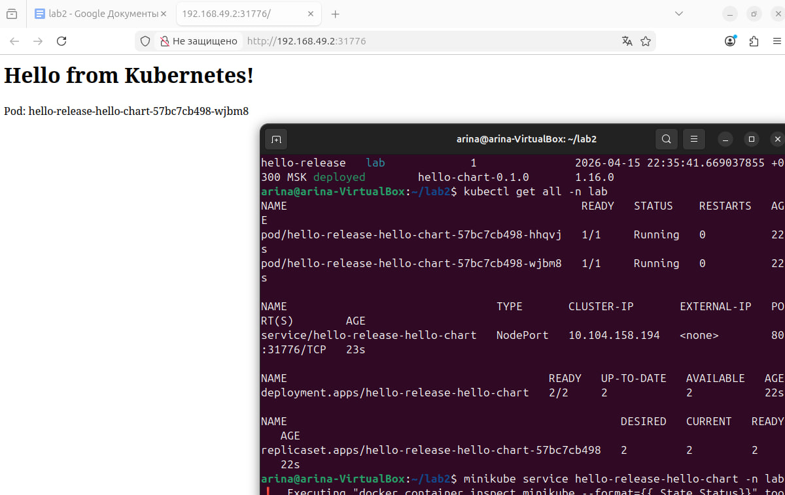

Проверила, что релиз установился (`helm list -n lab`) и под подхватил наш образ. Открыла адрес сервиса в браузере — страничка отдаётся, всё работает:

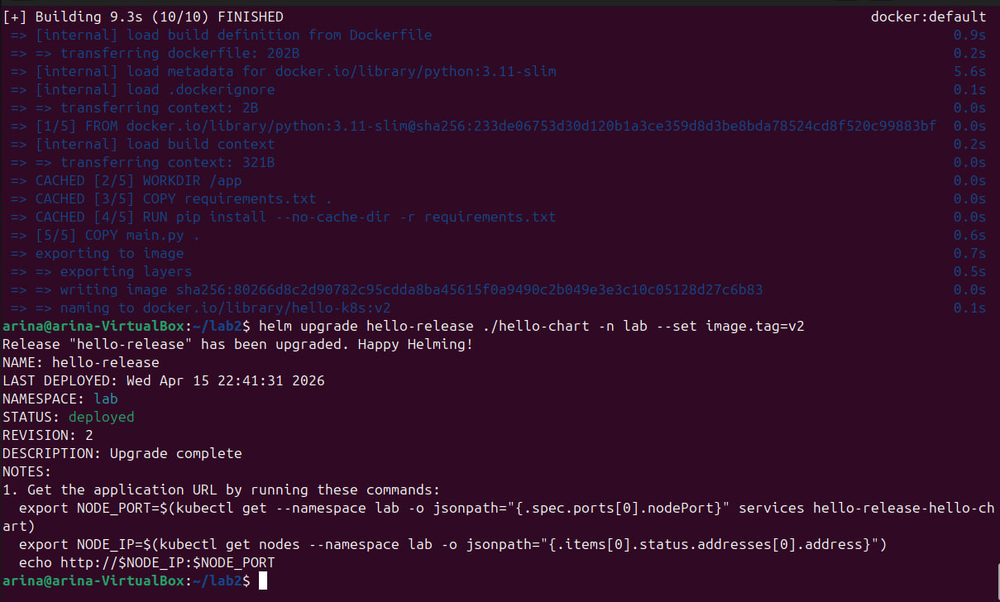

Дальше по заданию нужно было изменить что-то в сервисе и задеплоить новую версию через апгрейд релиза. Я отредактировала текст в `main.py` — заменила «Hello from Kubernetes!» на «Hello from Kubernetes! v2 HELM», пересобрала Docker-образ с новым тегом `v2` и сделала `helm upgrade`, передав новый тег через флаг `--set`:

```bash
eval $(minikube docker-env)
docker build -t hello-k8s:v2 ./app
helm upgrade hello-release ./hello-chart -n lab --set image.tag=v2
```

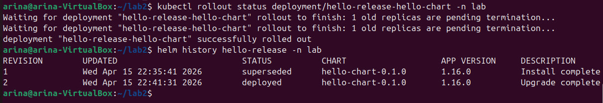

Дождалась завершения rolling update командой `kubectl rollout status` и посмотрела историю релизов через `helm history hello-release -n lab` — видно две ревизии: первая в статусе `superseded`, вторая `deployed`. В браузере страничка тоже обновилась — теперь там новый текст «Hello from Kubernetes! v2 HELM»:

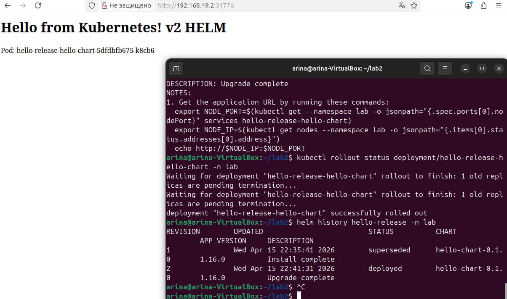

### 3 причины, почему использовать Helm удобнее, чем классический деплой через Kubernetes-манифесты

1. **Параметризация конфигурации.** В Helm основные настройки выносятся в `values.yaml`, поэтому для изменения версии образа, числа реплик, порта или любого другого параметра не нужно вручную редактировать несколько `.yaml` файлов. Можно даже не править файлы, а передать значение прямо при апгрейде через `--set image.tag=v2`. Это упрощает настройку приложения и снижает вероятность ошибок.

2. **Повторное использование и шаблоны.** Helm позволяет один раз сделать chart с шаблонами ресурсов Kubernetes и потом использовать его для разных окружений (dev/stage/prod) и версий приложения — достаточно подложить разные `values.yaml`. Шаблонизация на Go также избавляет от копипасты одинаковых лейблов, имён и селекторов в нескольких манифестах.

3. **Удобные обновления и откаты.** Helm работает через release и хранит историю всех ревизий (`helm history`). Это значит, что приложение удобно устанавливать (`helm install`), обновлять (`helm upgrade`) и откатывать на любую предыдущую версию одной командой (`helm rollback`). С чистым `kubectl` пришлось бы вручную хранить старые манифесты и применять их обратно.
