# Лабораторная работа 3 (база)

## Ход выполнения

### Часть 1

Сначала я установила nginx стандартным способом через `apt`:

```bash
sudo apt update
sudo apt install -y nginx
```

После установки проверила, что сервис работает и показывает статус `active (running)`:

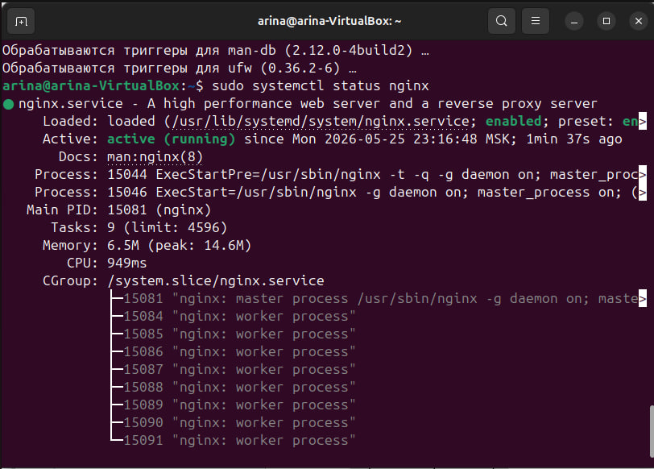

И открыла `http://localhost` в браузере, чтобы удостовериться, что nginx отдает стандартную страницу-приветствие:

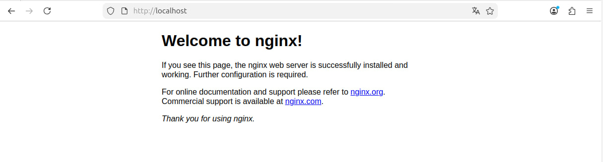

Далее нужно было поднять два пет-проекта на одном сервере. Я решила сделать их совсем простыми: первый — это блог, второй — магазин. Для каждого создала свою папку с `index.html`, а для магазина — еще отдельную папку `static_files`, в которую положила картинку.

```bash
sudo mkdir -p /var/www/myblog/html
sudo mkdir -p /var/www/myshop/html
sudo mkdir -p /var/www/myshop/static_files
```

Проверила, что все создалось и файлы на месте:

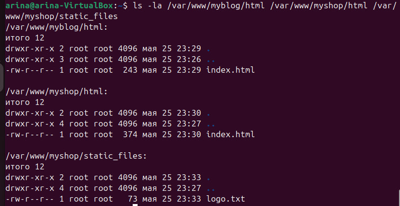

Чтобы сайты работали по HTTPS, я сгенерировала самоподписанный SSL-сертификат на 365 дней через `openssl`. nginx будет использовать его для шифрования соединения. Для лабы достаточно самоподписанного, браузер будет ругаться, но HTTPS работать будет.

```bash
sudo mkdir -p /etc/nginx/ssl
sudo openssl req -x509 -nodes -days 365 -newkey rsa:2048 \
  -keyout /etc/nginx/ssl/selfsigned.key \
  -out /etc/nginx/ssl/selfsigned.crt \
  -subj "/C=RU/ST=SPb/L=SPb/O=DevOpsLab/CN=localhost"
```

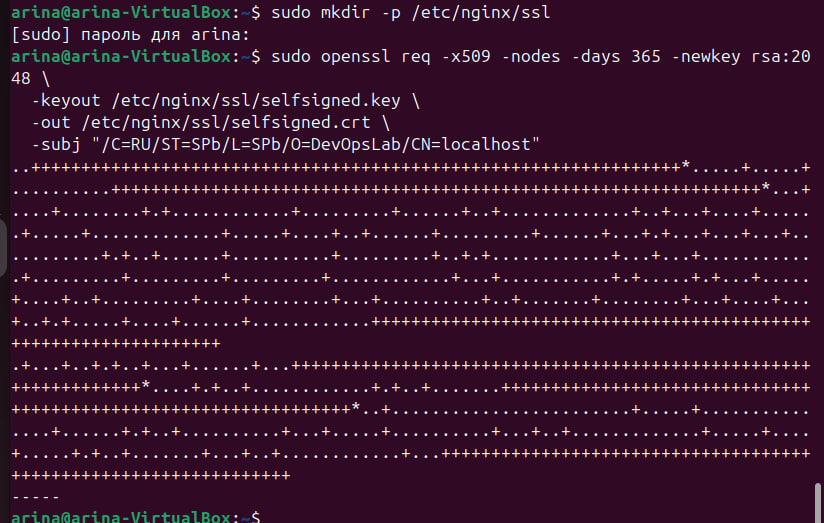

Сертификат и ключ появились в `/etc/nginx/ssl/`:

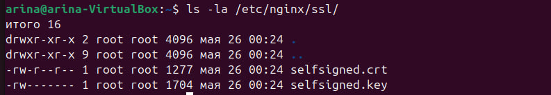

Дальше я написала два конфига виртуальных хостов в `/etc/nginx/sites-available/` — отдельно для блога и отдельно для магазина. nginx по заголовку `Host` сам определяет, какому сайту отдать запрос, и оба сайта работают на одних и тех же портах 80 и 443.

Прогнала проверку синтаксиса конфигов — обе строки `ok` и `successful`, значит можно перезапускать nginx:

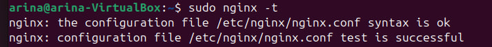

Чтобы домены `myblog.local` и `myshop.local` указывали на мою же виртуальную машину, я добавила их в `/etc/hosts`:

```bash
echo "127.0.0.1 myblog.local myshop.local" | sudo tee -a /etc/hosts
```

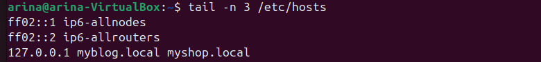

Далее я проверила, что все работает, и зашла на блог по HTTPS — открылась моя розовая страница, в адресной строке виден замочек (значит, соединение по HTTPS):

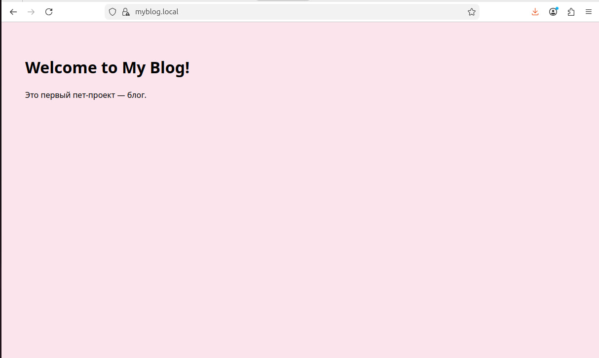

Затем зашла на магазин — открылась голубая страница, на которой картинка подгружается по пути `/images/dog.png`. 
Сам файл лежит в `/var/www/myshop/static_files/dog.png`, а отдаётся по URL `/images/...`, и таким образом работает alias:

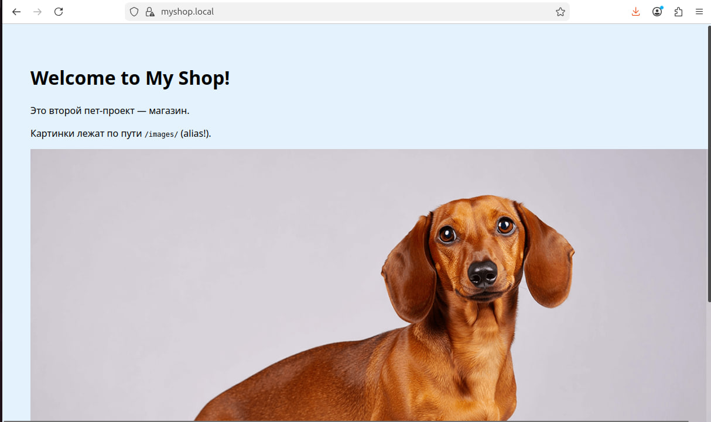

Чтобы показать, что alias реально работает, открыла картинку напрямую по ее URL `/images/dog.png`:


Также я сделала секретную страничку, которая через директиву `return 200 "..."` отдает собственный текст, минуя файловую систему:

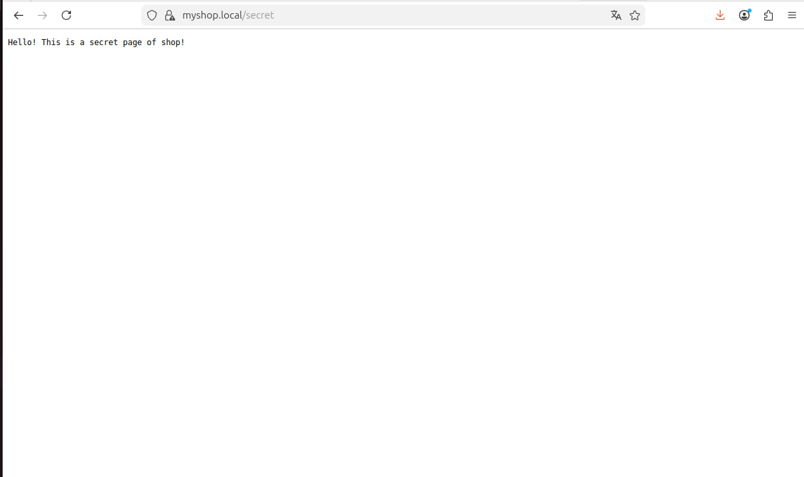

И последнее, что нужно было показать — что редирект HTTP → HTTPS реально работает. Сделала запрос через `curl -I http://myblog.local` и получила в ответ код `301 Moved Permanently` с заголовком `Location: https://myblog.local/`. То есть любой пользователь, который случайно зайдёт по `http://`, будет автоматически переадресован на HTTPS:

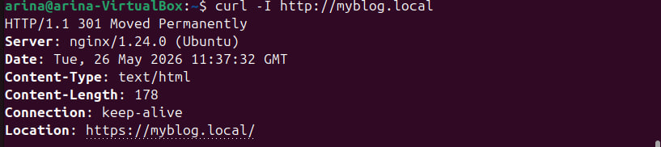

### Часть 2

Для второй части я попробовала проверить сайт https://www.ftsspb.ru/ (сайт Федерации танцевального спорта Санкт-Петербурга) на три уязвимости. Использовала только GET-запросы, ничего на сайте не меняла и не пыталась авторизоваться.

Для работы поставила несколько утилит:

```bash
sudo apt install -y curl nmap whatweb wget ffuf jq
```

Также скачала словарь путей `common.txt`, в нем ~4750 типовых путей (`/admin`, `/login`, `/backup`, `/.git` и т.п.), которые часто встречаются на сайтах:

```bash
mkdir -p ~/wordlists
wget -O ~/wordlists/common.txt https://raw.githubusercontent.com/danielmiessler/SecLists/master/Discovery/Web-Content/common.txt
```

Проверила, что инструменты установились и словарь скачался:

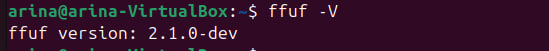
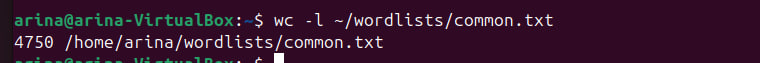

#### Уязвимость №1: Information Disclosure

Идея такая, что веб-сервер не должен раскрывать в заголовках ответа точные версии используемого ПО, иначе атакующий может загуглить публичные CVE именно для этой версии и попробовать их использовать. По best practices версия должна быть скрыта.

Сначала посмотрим, что отдает сервер в заголовках:

```bash
curl -I https://www.ftsspb.ru/
```

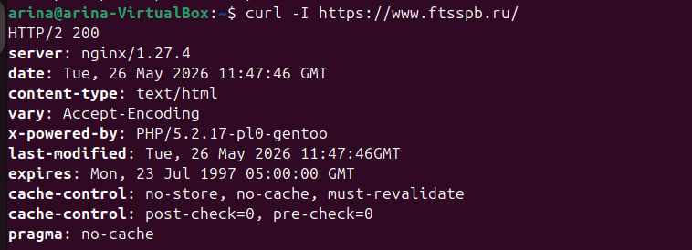

Видно сразу несколько проблем:
- `server: nginx/1.27.4` — раскрыта точная версия nginx.
- `x-powered-by: PHP/5.2.17-pl0-gentoo` — раскрыта точная версия PHP (причем версия релиза 2011 года...)
- `expires: Mon, 23 Jul 1997` — дата истечения кэша.
- отсутствуют security-заголовки: `Strict-Transport-Security` (HSTS), `X-Frame-Options`, `Content-Security-Policy`, `X-Content-Type-Options`.

Далее я прогнала `whatweb` — это утилита, которая определяет «отпечаток» сайта:

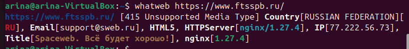

Подтвердились версии `nginx 1.27.4`, плюс определился хостинг `Spaceweb` и IP сервера. Это тоже информация, которая помогает атакующему понять, где сайт хостится и можно ли его атаковать через хостинг.

Затем посмотрела через `nmap`, какие порты открыты на сервере:

```bash
nmap -Pn -p 80,443,22,21,8080,8443 www.ftsspb.ru
```

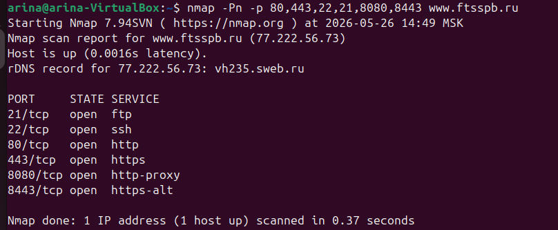

Открыты порты:
- 21 — FTP,
- 22 — SSH,
- 80 — HTTP,
- 443 — HTTPS,
- 8080 — http-proxy,
- 8443 — https-alt.

Итог 1: первая уязвимость проверена успешно. Получены точные версии ПО, известна CMS-инфраструктура и хостинг-провайдер. Отсутствуют security-заголовки.

#### Уязвимость №2: перебор скрытых путей через ffuf

На сайте могут быть страницы и директории, не указанные в меню — админы, тестовые странички, бэкапы, служебные файлы. Их можно найти, перебирая URL по словарю типовых путей.

Запустила `ffuf`:

```bash
ffuf -u https://www.ftsspb.ru/FUZZ \
     -w ~/wordlists/common.txt \
     -mc 200,301,302,403 \
     -t 10 \
     -o ~/ffuf_results.json
```

ffuf прошёл все 4751 путей словаря:

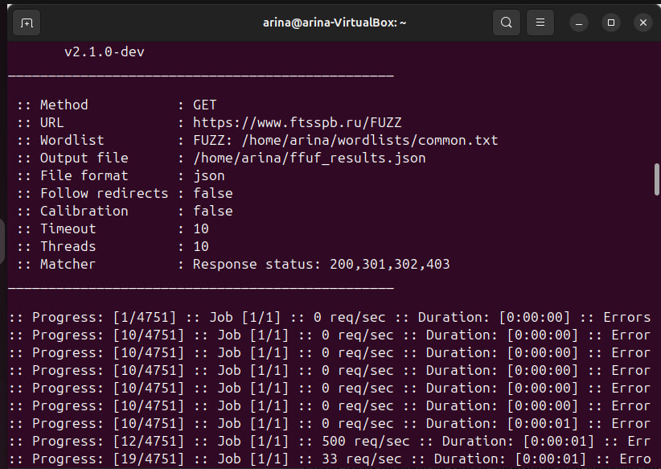

В сводке сам ffuf ничего не вывел, поэтому проверила это вручную и запросила заведомо несуществующий путь `/abracadabra12345` и получила 200 OK:

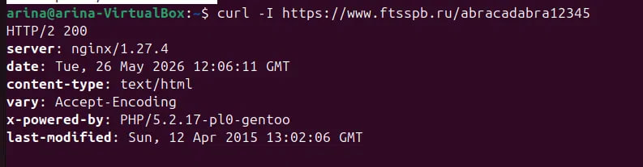

Далее я вытащила результаты из JSON-файла:

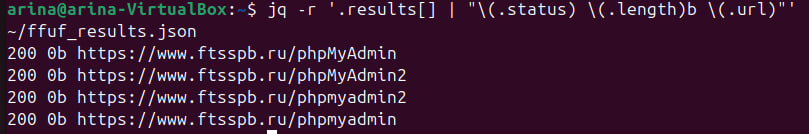

Нашлось 4 пути, и все они — варианты адреса **phpMyAdmin**

phpMyAdmin — это веб-интерфейс для управления базой данных MySQL. По best practices он должен быть либо доступен только из внутренней сети хостинга, либо защищен дополнительной авторизацией.

Проверила каждый путь через `curl -I` — все четыре отвечают 200 OK:

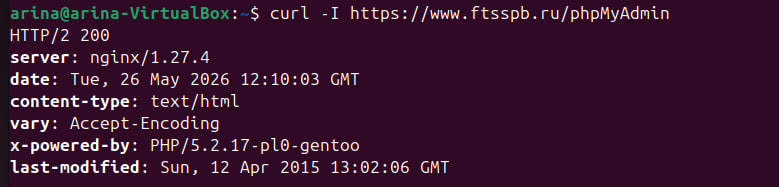
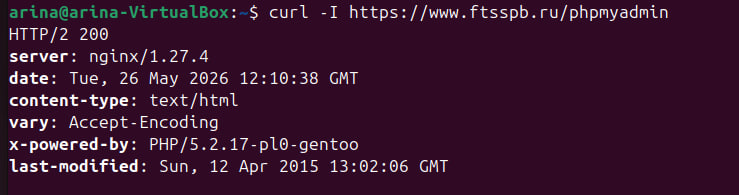
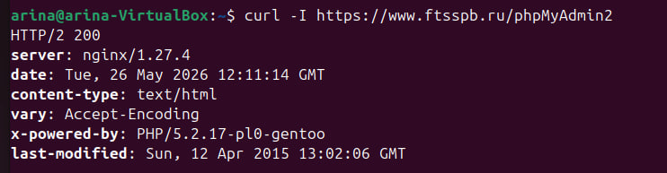
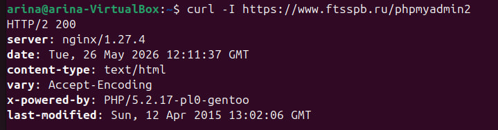

И открыла их в браузере — страницы открываются, отдают пустое тело (но путь существует):

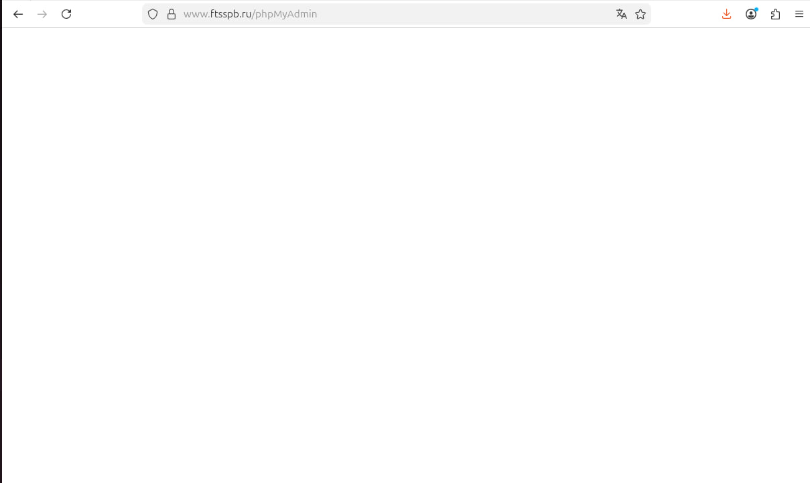
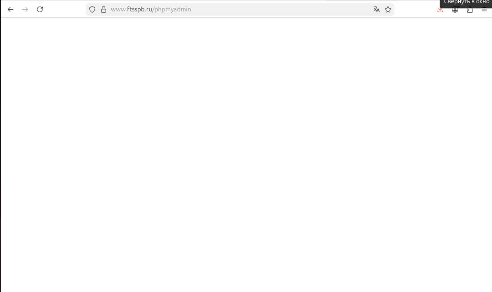

Итог 2: вторая уязвимость проверена успешно. Обнаружены пути интерфейса phpMyAdmin в публичном доступе. Я попала на страницы, которые с точки зрения сайта не должны быть видны простому пользователю.

#### Уязвимость №3: Path Traversal

На плохо настроенных серверах можно через пути вида `../../../etc/passwd` выйти за пределы папки сайта и прочитать системные файлы.

Я попробовала несколько вариантов обхода:
1. Прямой обход через ../
Получила код `415 Unsupported Media Type`. Сервер не пустил:

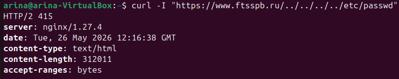

2. URL-encoded слеши
Получила `400 Bad Request` — сервер тоже отверг:

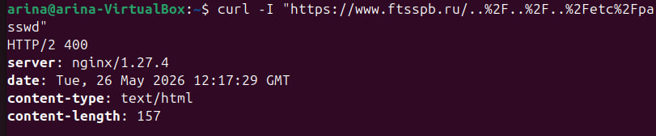

3. Double URL-encoding
Сервер вернул 200, но никакого файла не прочитано:

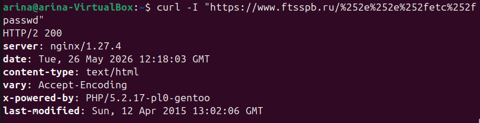

4. alias misconfiguration в nginx
Тоже soft 404, файл не прочитан:

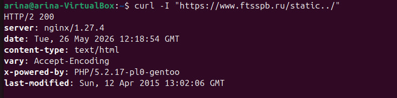

Итог 3: третью уязвимость не получилось проверить, все варианты path traversal не сработали. Сервер либо отвергает попытки выйти за пределы папки сайта, либо отдает стандартный soft 404.
