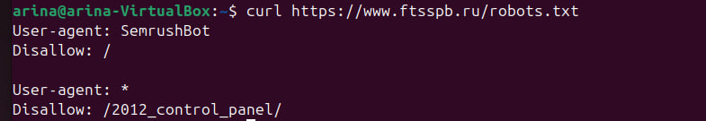

# Лабораторная работа 3 (база)

## Ход выполнения

### Часть 1: настройка nginx

Сначала я установила nginx стандартным способом через `apt`:

```bash
sudo apt update
sudo apt install -y nginx
```

После установки проверила, что сервис работает — статус `active (running)`:


И открыла `http://localhost` в браузере, чтобы убедиться, что nginx отдаёт стандартную страницу-приветствие:


Дальше по условию мне нужно было поднять «два пет-проекта на одном сервере». Я решила сделать их совсем простыми: первый — это «блог» (`myblog.local`), второй — «магазин» (`myshop.local`). Для каждого создала свою папку с `index.html`, а для магазина — ещё отдельную папку `static_files`, в которую положила картинку. Эта папка нужна, чтобы дальше показать работу директивы `alias` (один из пунктов ТЗ).

```bash
sudo mkdir -p /var/www/myblog/html
sudo mkdir -p /var/www/myshop/html
sudo mkdir -p /var/www/myshop/static_files
```

Проверила, что всё создалось и файлы на месте:


Чтобы сайты работали по HTTPS (пункт ТЗ №1), я сгенерировала самоподписанный SSL-сертификат на 365 дней через `openssl`. Это пара «приватный ключ + сертификат», которую nginx будет использовать для шифрования соединения. В реальном проекте сертификат брался бы у Let's Encrypt или другого CA, но для лабы самоподписанного достаточно — браузер будет ругаться, но HTTPS работать будет.

```bash
sudo mkdir -p /etc/nginx/ssl
sudo openssl req -x509 -nodes -days 365 -newkey rsa:2048 \
  -keyout /etc/nginx/ssl/selfsigned.key \
  -out /etc/nginx/ssl/selfsigned.crt \
  -subj "/C=RU/ST=SPb/L=SPb/O=DevOpsLab/CN=localhost"
```


Сертификат и ключ появились в `/etc/nginx/ssl/`:


Дальше я написала два конфига виртуальных хостов в `/etc/nginx/sites-available/` — отдельно для блога и отдельно для магазина. Это и есть пункт ТЗ №4: «настроить виртуальные хосты для обслуживания нескольких доменных имён на одном сервере». nginx по заголовку `Host` (директива `server_name` в конфиге) сам определяет, какому сайту отдать запрос, и оба сайта работают на одних и тех же портах 80 и 443.

`myblog`:
```nginx
# HTTP -> HTTPS редирект (пункт ТЗ №2)
server {
    listen 80;
    server_name myblog.local;
    return 301 https://$host$request_uri;
}

# HTTPS виртуальный хост для блога (пункты ТЗ №1, №4)
server {
    listen 443 ssl;
    server_name myblog.local;

    ssl_certificate     /etc/nginx/ssl/selfsigned.crt;
    ssl_certificate_key /etc/nginx/ssl/selfsigned.key;

    root /var/www/myblog/html;
    index index.html;

    location / {
        try_files $uri $uri/ =404;
    }
}
```

`myshop`:
```nginx
# HTTP -> HTTPS редирект
server {
    listen 80;
    server_name myshop.local;
    return 301 https://$host$request_uri;
}

# HTTPS виртуальный хост для магазина
server {
    listen 443 ssl;
    server_name myshop.local;

    ssl_certificate     /etc/nginx/ssl/selfsigned.crt;
    ssl_certificate_key /etc/nginx/ssl/selfsigned.key;

    root /var/www/myshop/html;
    index index.html;

    location / {
        try_files $uri $uri/ =404;
    }

    # ALIAS (пункт ТЗ №3):
    # URL вида /images/foo.png будет отдавать файл из /var/www/myshop/static_files/foo.png
    # Отличие от root: при alias URL-префикс /images/ ОТБРАСЫВАЕТСЯ,
    # а не дописывается к пути, как было бы у root.
    location /images/ {
        alias /var/www/myshop/static_files/;
    }

    # Что-то ещё (пункт ТЗ №5) — отдельный location со своим ответом
    location /secret {
        return 200 "Hello! This is a secret page of shop!\n";
        add_header Content-Type text/plain;
    }
}
```

Чтобы конфиги стали активными, я создала на них симлинки в `sites-enabled/` и убрала дефолтный сайт, чтобы он не мешал:

```bash
sudo ln -sf /etc/nginx/sites-available/myblog /etc/nginx/sites-enabled/myblog
sudo ln -sf /etc/nginx/sites-available/myshop /etc/nginx/sites-enabled/myshop
sudo rm -f /etc/nginx/sites-enabled/default
```

Прогнала проверку синтаксиса конфигов — обе строки `ok` и `successful`, значит можно перезапускать nginx:


Чтобы домены `myblog.local` и `myshop.local` указывали на мою же машину, я добавила их в `/etc/hosts`. В обычной жизни этим занимается DNS, но для локальной лабы достаточно `hosts`-файла:

```bash
echo "127.0.0.1 myblog.local myshop.local" | sudo tee -a /etc/hosts
```


После `sudo systemctl reload nginx` проверила, что всё работает. Сначала зашла на блог по HTTPS — открылась моя розовая страница, в адресной строке виден замочек (значит соединение по HTTPS):


Затем зашла на магазин — открылась голубая страница, на которой картинка подгружается по пути `/images/dog.png`. Сам файл лежит в `/var/www/myshop/static_files/dog.png`, а отдаётся по URL `/images/...` — это работает alias:


Чтобы показать, что alias реально работает, открыла картинку напрямую по её URL `/images/dog.png` — файл отдаётся:


Также проверила пункт «что-то ещё» — location `/secret`, который через директиву `return 200 "..."` отдаёт собственный текст, минуя файловую систему:


И последнее, что нужно было показать — что редирект HTTP → HTTPS реально работает. Сделала запрос через `curl -I http://myblog.local` и получила в ответ код `301 Moved Permanently` с заголовком `Location: https://myblog.local/`. То есть любой пользователь, который случайно зайдёт по `http://`, будет автоматически переадресован на HTTPS:


#### Что сделано по пунктам ТЗ

1. **HTTPS с сертификатом.** Сгенерирован самоподписанный сертификат через `openssl` на 365 дней (`/etc/nginx/ssl/`). В каждом виртуальном хосте указаны директивы `ssl_certificate` и `ssl_certificate_key`. Сайты работают на 443 порту.
2. **Принудительный редирект HTTP → HTTPS.** Для каждого виртуального хоста есть отдельный `server`-блок на 80 порту, который через `return 301 https://$host$request_uri;` перенаправляет все запросы на HTTPS. Проверено через `curl -I` — возвращается код 301.
3. **Alias.** В конфиге `myshop` использована директива `location /images/ { alias /var/www/myshop/static_files/; }`. Отличие от `root` в том, что при `alias` URL-префикс `/images/` отбрасывается и подставляется указанный путь. Если бы я использовала `root /var/www/myshop/static_files/`, то по URL `/images/dog.png` nginx бы искал файл `/var/www/myshop/static_files/images/dog.png`, а с alias — просто `/var/www/myshop/static_files/dog.png`.
4. **Виртуальные хосты.** Два отдельных конфига (`myblog` и `myshop`) в `/etc/nginx/sites-available/`, включены через симлинки в `sites-enabled/`. nginx по заголовку `Host` (директива `server_name`) отдаёт нужный сайт. Оба сайта работают на одних и тех же портах 80 и 443.
5. **Дополнительно.** Добавлен location `/secret` с собственным ответом через `return 200 ...` — показывает, что в nginx можно отдавать содержимое не только из файлов, но и формировать ответ прямо в конфиге.

### Часть 2: проверка nginx на уязвимости

Для второй части я попробовала проверить сайт https://www.ftsspb.ru/ (сайт Федерации танцевального спорта Санкт-Петербурга) на три уязвимости. Использовала только GET-запросы, ничего на сайте не меняла и не пыталась авторизоваться — только разведка.

Для работы поставила несколько утилит:

```bash
sudo apt install -y curl nmap whatweb wget ffuf jq
```

Также скачала словарь путей `common.txt` из проекта SecLists — это популярный словарь, в нём ~4750 типовых путей (`/admin`, `/login`, `/backup`, `/.git` и т.п.), которые часто встречаются на сайтах:

```bash
mkdir -p ~/wordlists
wget -O ~/wordlists/common.txt https://raw.githubusercontent.com/danielmiessler/SecLists/master/Discovery/Web-Content/common.txt
```

Проверила, что инструменты установились и словарь скачался:


#### Уязвимость №1: Information Disclosure (раскрытие информации о сервере)

**Идея.** Веб-сервер не должен раскрывать в заголовках ответа точные версии используемого ПО — иначе атакующий может загуглить публичные CVE именно для этой версии и попробовать их использовать. По best practices версия должна быть скрыта (`server_tokens off;` в nginx, `expose_php = Off` в PHP).

Сначала посмотрела, что отдаёт сервер в заголовках:

```bash
curl -I https://www.ftsspb.ru/
```


Видно сразу несколько проблем:
- `server: nginx/1.27.4` — раскрыта точная версия nginx.
- `x-powered-by: PHP/5.2.17-pl0-gentoo` — раскрыта точная версия PHP, причём это **PHP 5.2.17, релиз 2011 года**. Официальная поддержка PHP 5.2 закончилась в начале 2011 года, с тех пор найдены десятки критических уязвимостей. То есть сайт работает на PHP, в которой ничего не патчили ~14 лет.
- `expires: Mon, 23 Jul 1997` — заведомо «протухшая» дата истечения кэша.
- Отсутствуют security-заголовки: `Strict-Transport-Security` (HSTS), `X-Frame-Options`, `Content-Security-Policy`, `X-Content-Type-Options`.

Дальше прогнала `whatweb` — это утилита, которая определяет «отпечаток» сайта (CMS, фреймворки, хостинг):


Подтвердились версии (`nginx 1.27.4`), плюс определился хостинг (`Spaceweb`) и IP сервера. Это тоже информация, которая помогает атакующему понять, где сайт хостится и можно ли его атаковать через хостинг.

Затем посмотрела через `nmap`, какие порты открыты на сервере:

```bash
nmap -Pn -p 80,443,22,21,8080,8443 www.ftsspb.ru
```


Открыты порты:
- 21 — FTP (передача файлов, очень не любит современная безопасность),
- 22 — SSH,
- 80 — HTTP,
- 443 — HTTPS,
- 8080 — http-proxy,
- 8443 — https-alt (альтернативный HTTPS).

Это shared-хостинг (на одном IP много сайтов), и эти порты, скорее всего, принадлежат хостеру, а не конкретному сайту, но сама их доступность снаружи — повод задуматься.

**Вердикт:** ✅ успешно. Получены точные версии ПО (nginx, PHP), причём PHP — крайне старая и небезопасная. Известна CMS-инфраструктура и хостинг-провайдер. Отсутствуют security-заголовки.

#### Уязвимость №2: перебор скрытых путей через ffuf

**Идея.** На сайте могут быть страницы и директории, не указанные в меню — админки, тестовые странички, бэкапы, служебные файлы. Их можно найти, перебирая URL по словарю типовых путей.

Запустила `ffuf`:

```bash
ffuf -u https://www.ftsspb.ru/FUZZ \
     -w ~/wordlists/common.txt \
     -mc 200,301,302,403 \
     -t 10 \
     -o ~/ffuf_results.json
```

Параметры:
- `FUZZ` — место в URL, куда ffuf по очереди подставляет каждое слово из словаря;
- `-mc 200,301,302,403` — показывать только ответы с этими кодами (200 — страница есть, 301/302 — редирект, 403 — путь существует, но доступ запрещён);
- `-t 10` — всего 10 потоков, чтобы не нагружать сайт (никакого DDoS);
- `-o ffuf_results.json` — сохранить результаты в файл.

Сканирование шло ~5 минут, ffuf прошёл все 4751 путей словаря:


В сводке сам ffuf ничего не вывел — потому что сайт на любой несуществующий URL отдаёт код 200 со стандартной страницей (это называется **soft 404** — сервер технически возвращает 200, но контентно это 404). Проверила это вручную: запросила заведомо несуществующий путь `/abracadabra12345` и получила 200 OK:


Поэтому я вытащила результаты из JSON-файла через `jq` — это утилита для красивого просмотра JSON. В фильтре оставила только то, что отличалось от типового мусорного 200:

```bash
jq -r '.results[] | "\(.status) \(.length)b \(.url)"' ~/ffuf_results.json
```


Нашлось 4 пути, и все они — варианты адреса **phpMyAdmin**:
- `https://www.ftsspb.ru/phpMyAdmin`
- `https://www.ftsspb.ru/phpMyAdmin2`
- `https://www.ftsspb.ru/phpmyadmin`
- `https://www.ftsspb.ru/phpmyadmin2`

**phpMyAdmin — это веб-интерфейс для управления базой данных MySQL.** По best practices он должен быть либо доступен только из внутренней сети хостинга, либо защищён дополнительной авторизацией (basic auth, IP whitelist). Открытый снаружи phpMyAdmin — это типовая мишень для перебора паролей и эксплуатации публичных CVE самого phpMyAdmin.

Проверила каждый путь через `curl -I` — все четыре отвечают 200 OK:


И открыла их в браузере — страницы открываются, отдают пустое тело (но статус 200, путь существует):


Никаких форм логина я не пробовала и пароли не подбирала — задача была только показать, что путь существует там, где его не должно быть.

**Вердикт:** ✅ успешно. Обнаружены пути административного интерфейса phpMyAdmin в публичном доступе. Я попала на страницы, которые с точки зрения сайта не должны быть видны простому пользователю.

#### Уязвимость №3: Path Traversal

**Идея.** На плохо настроенных серверах можно через специально сформированные пути вида `../../../etc/passwd` выйти за пределы папки сайта и прочитать системные файлы. Если в nginx есть `location` с `alias` без `/` на конце (классическая ошибка конфигурации) — это тоже даёт path traversal.

Я попробовала несколько классических вариантов обхода:

```bash
# 1. Прямой обход через ../
curl -I "https://www.ftsspb.ru/../../../../etc/passwd"
```
Получила код `415 Unsupported Media Type`. Сервер не пустил:


```bash
# 2. URL-encoded слеши (обход простых фильтров через %2F)
curl -I "https://www.ftsspb.ru/..%2F..%2F..%2Fetc%2Fpasswd"
```
Получила `400 Bad Request` — сервер тоже отверг:


```bash
# 3. Double URL-encoding (%252e = двойное кодирование точки)
curl -I "https://www.ftsspb.ru/%252e%252e%252fetc%252fpasswd"
```
Сервер вернул 200, но это тот же soft 404 (то же поведение, что и на /abracadabra) — никакого файла не прочитано:



```bash
# 4. Классическая alias misconfiguration в nginx —
# когда location /static настроен без слеша на конце
curl -I "https://www.ftsspb.ru/static../"
```
Тоже soft 404, файл не прочитан:


**Вердикт:** ❌ не успешно. Все варианты path traversal не сработали. Сервер либо отвергает попытки выйти за пределы папки сайта, либо отдаёт стандартный soft 404. С этой стороны конфигурация nginx у них в порядке.

#### Бонус: robots.txt подсказывает «скрытые» пути

Также я посмотрела `robots.txt`. Это файл, в котором владельцы сайта указывают поисковикам, какие разделы НЕ индексировать. На практике туда часто пишут именно те пути, которые «не для всех» — и тем самым сами подсказывают атакующему, куда смотреть:

```bash
curl https://www.ftsspb.ru/robots.txt
```


Здесь в `Disallow:` указан путь `/2012_control_panel/` — то есть владельцы сайта сами подсказывают, где у них находится какая-то «панель управления» 2012 года. Это не уязвимость сама по себе, но это плохая практика: «секретные» пути не нужно прятать в robots.txt, лучше защищать их авторизацией.

#### Итог по второй части

Из трёх проверенных уязвимостей две (Information Disclosure и перебор путей через ffuf) оказались успешными в смысле задания — удалось получить информацию, которую владельцам сайта не следовало бы раскрывать, и попасть в раздел сайта, не предназначенный для обычных пользователей. Третья (Path Traversal) — не сработала, сервер корректно отвергает попытки выхода за пределы корня сайта.

Найденные проблемы я никак не использовала и в phpMyAdmin не пыталась авторизоваться — целью лабораторной было показать, что неточности в конфигурации могут давать доступ к разделам, которые администратор не планировал открывать.
