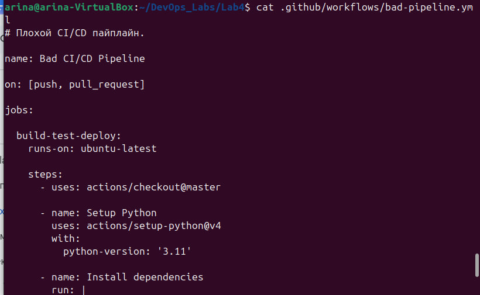
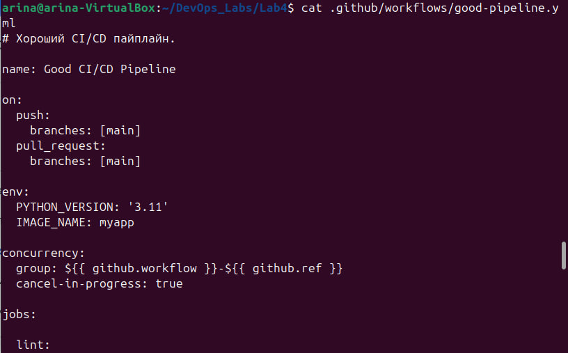
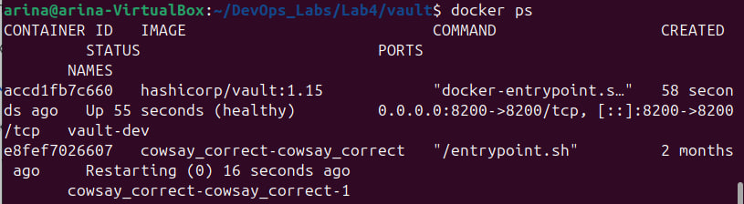
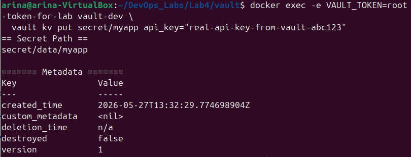
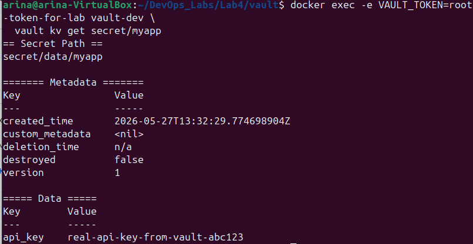
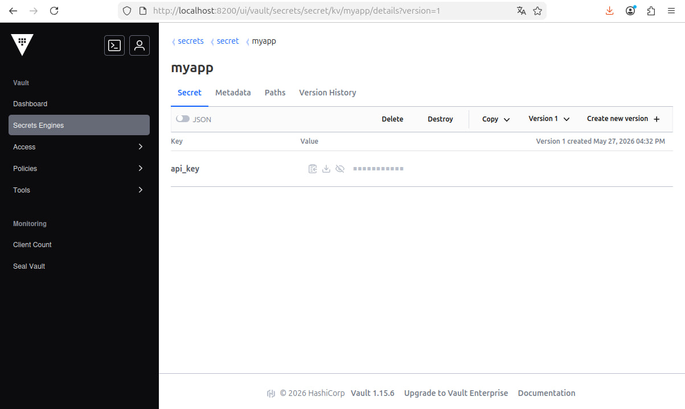
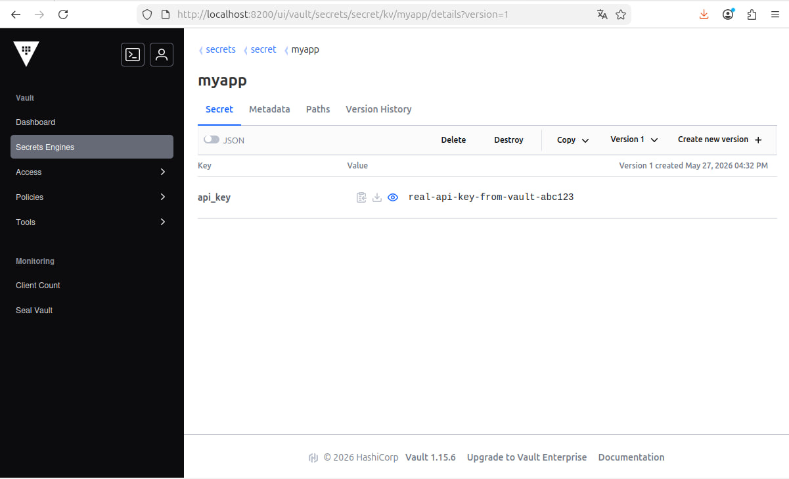
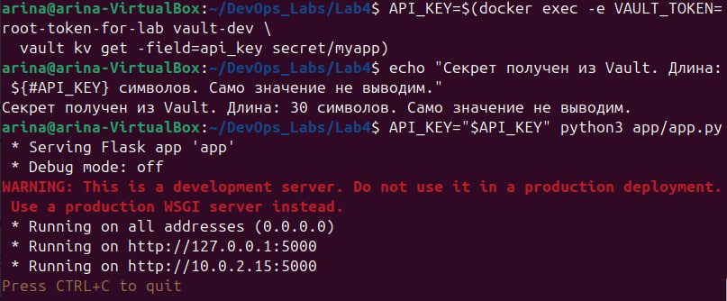
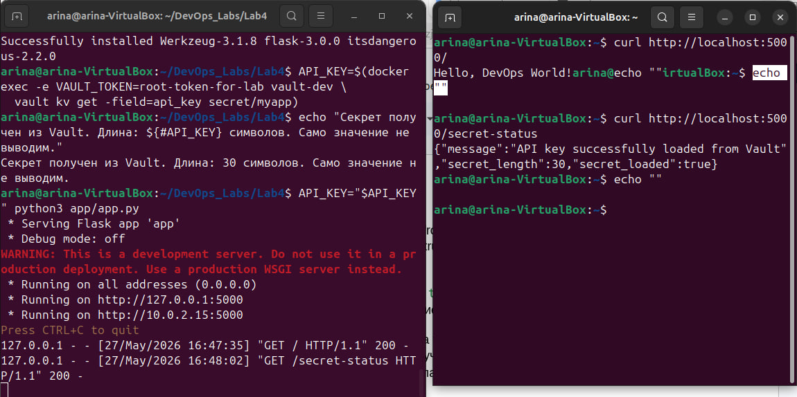

# Лабораторная работа 4 (база)

## Ход выполнения

Перед началом работы я создала структуру проекта внутри папки `Lab4/`. В качестве CI/CD-системы выбрала **GitHub Actions**, в качестве учебного приложения — простой Flask hello-world. Структура получилась такая:

### Часть 1:

В первой части мне нужно было написать плохой и хороший CI/CD пайплайны. Я начала с приложения, для которого пайплайны будут работать.

`app/app.py`:
```python
import os
from flask import Flask, jsonify

app = Flask(__name__)


def get_api_key():
    """Безопасно получает API-ключ из переменной окружения."""
    return os.environ.get("API_KEY")


@app.route("/")
def hello():
    return "Hello, DevOps World!"


@app.route("/health")
def health():
    return jsonify({"status": "ok"})


@app.route("/secret-status")
def secret_status():
    """Показывает, что секрет получен, но НЕ показывает сам секрет."""
    key = get_api_key()
    if key:
        return jsonify({
            "secret_loaded": True,
            "secret_length": len(key),
            "message": "API key successfully loaded from Vault"
        })
    return jsonify({"secret_loaded": False}), 500


if __name__ == "__main__":
    app.run(host="0.0.0.0", port=5000)
```

`app/requirements.txt`:
```
flask==3.0.0
pytest==7.4.3
```

Для пайплайна я также написала простой тест в `tests/test_app.py`, который проверяет, что endpoint `/` отвечает «Hello», а `/health` возвращает `{"status": "ok"}`. И добавила минимальный `Dockerfile` на базе `python:3.11-slim`, чтобы пайплайн мог собрать образ.

После этого я написала **плохой пайплайн** с шестью плохими практиками сразу (с запасом по сравнению с требованием «не менее пяти»):

`.github/workflows/bad-pipeline.yml`:
```yaml
name: Bad CI/CD Pipeline

# Плохая практика №1: запуск на любой push в любую ветку без ограничений
on: [push, pull_request]

jobs:
  build-test-deploy:
    # Плохая практика №2: всё в одной огромной job
    runs-on: ubuntu-latest
    steps:
      # Плохая практика №3: @master вместо фиксированной версии
      - uses: actions/checkout@master

      - name: Setup Python
        uses: actions/setup-python@v4
        with:
          python-version: '3.11'

      # Плохая практика №4: установка зависимостей без кэширования
      - name: Install dependencies
        run: |
          cd app
          pip install -r requirements.txt

      # Плохая практика №5: секреты прямо в коде пайплайна (хардкод)
      - name: Run tests with API key
        env:
          API_KEY: "super-secret-api-key-12345"
          DB_PASSWORD: "admin123"
        run: |
          # Плохая практика №6: вывод секретов в логи
          echo "Running tests with API_KEY=$API_KEY"
          pytest tests/

      - name: Build Docker image
        run: |
          cd app
          docker build -t myapp:latest .  # часть №3: тег latest

      - name: Deploy
        run: |
          echo "Deploying myapp:latest to production..."
          echo "Done"
```



Затем написала **хороший пайплайн** с пятью этапами: `lint → test → build → security-scan → deploy`. Каждый следующий этап запускается только после успешного завершения предыдущего благодаря `needs:`.

`.github/workflows/good-pipeline.yml`:
```yaml
name: Good CI/CD Pipeline

# Исправление №1: запускаемся только на нужные ветки
on:
  push:
    branches: [main]
  pull_request:
    branches: [main]

env:
  PYTHON_VERSION: '3.11'
  IMAGE_NAME: myapp

concurrency:
  group: ${{ github.workflow }}-${{ github.ref }}
  cancel-in-progress: true

jobs:

  # ===== ЭТАП 1: Линтер =====
  lint:
    name: Lint code
    runs-on: ubuntu-latest
    steps:
      # Исправление №3: фиксируем версию action
      - uses: actions/checkout@v4
      - name: Setup Python
        uses: actions/setup-python@v5
        with:
          python-version: ${{ env.PYTHON_VERSION }}
          # Исправление №4: включаем кэширование
          cache: 'pip'
          cache-dependency-path: app/requirements.txt
      - run: pip install flake8==6.1.0
      - run: flake8 app/ --max-line-length=100

  # ===== ЭТАП 2: Тесты =====
  test:
    name: Run tests
    runs-on: ubuntu-latest
    needs: lint
    steps:
      - uses: actions/checkout@v4
      - uses: actions/setup-python@v5
        with:
          python-version: ${{ env.PYTHON_VERSION }}
          cache: 'pip'
          cache-dependency-path: app/requirements.txt
      - run: pip install -r app/requirements.txt
      - run: pytest tests/ -v

  # ===== ЭТАП 3: Сборка Docker-образа =====
  build:
    name: Build Docker image
    runs-on: ubuntu-latest
    needs: test
    steps:
      - uses: actions/checkout@v4
      - uses: docker/setup-buildx-action@v3
      - uses: docker/build-push-action@v5
        with:
          context: ./app
          push: false
          # Версионируем по SHA коммита, а не latest
          tags: |
            ${{ env.IMAGE_NAME }}:${{ github.sha }}
            ${{ env.IMAGE_NAME }}:latest
          cache-from: type=gha
          cache-to: type=gha,mode=max

  # ===== ЭТАП 4: Сканирование безопасности =====
  security-scan:
    name: Security scan
    runs-on: ubuntu-latest
    needs: build
    steps:
      - uses: actions/checkout@v4
      - uses: aquasecurity/trivy-action@0.20.0
        with:
          scan-type: 'fs'
          scan-ref: '.'
          severity: 'HIGH,CRITICAL'
          exit-code: '0'

  # ===== ЭТАП 5: Деплой =====
  deploy:
    name: Deploy to staging
    runs-on: ubuntu-latest
    needs: security-scan
    if: github.event_name == 'push' && github.ref == 'refs/heads/main'
    environment: staging
    steps:
      - uses: actions/checkout@v4

      # Исправление №5 и №6: секрет берётся из Vault и маскируется в логах
      - name: Fetch secret from Vault
        id: vault-secret
        uses: hashicorp/vault-action@v3
        with:
          url: ${{ secrets.VAULT_ADDR }}
          token: ${{ secrets.VAULT_TOKEN }}
          secrets: |
            secret/data/myapp api_key | API_KEY

      - name: Deploy application
        env:
          API_KEY: ${{ steps.vault-secret.outputs.API_KEY }}
        run: |
          echo "Deploying ${{ env.IMAGE_NAME }}:${{ github.sha }} to staging..."
          if [ -n "$API_KEY" ]; then
            echo "Secret loaded successfully (length: ${#API_KEY})"
          else
            echo "ERROR: secret not loaded"
            exit 1
          fi
          echo "Deploy finished"
```



### Разбор плохих практик и их исправлений

**Плохая практика №1: запуск пайплайна на push в любую ветку.**
В плохом файле было `on: [push, pull_request]` — пайплайн запускается на любой push в любую ветку, включая черновые ветки разработчиков. Это тратит минуты CI впустую, замедляет работу команды и в теории может запустить деплой даже с feature-ветки. В хорошем файле я ограничила запуск только событиями для ветки `main` и добавила блок `concurrency`, который при нескольких коммитах подряд отменяет старые запуски — выполняется только самый свежий.

**Плохая практика №2: всё в одной огромной job.**
В плохом файле один job `build-test-deploy` делал всё подряд: установку, тесты, сборку, деплой. При таком подходе нет параллелизации этапов, при падении на одном шаге нельзя перезапустить только его — нужно гонять весь пайплайн заново, и в UI GitHub Actions не видно красивой цепочки этапов. В хорошем файле я разделила работу на 5 отдельных jobs, связанных через `needs:`, поэтому каждый этап изолирован и его видно отдельно.

**Плохая практика №3: `@master` и тег `latest` вместо фиксированных версий.**
В плохом файле было `uses: actions/checkout@master` и `docker build -t myapp:latest`. `@master` — это ссылка на постоянно меняющуюся ветку action: сегодня пайплайн работает, завтра автор выкатил breaking change, и он ломается без единого коммита с твоей стороны. Тег `latest` у Docker-образа не позволяет понять, какая версия сейчас в проде, и невозможно откатиться на предыдущую. В хорошем файле я зафиксировала action на `@v4`, а образ помечаю одновременно SHA коммита и `latest` — по SHA всегда можно найти исходник и откатиться.

**Плохая практика №4: установка зависимостей без кэширования.**
В плохом файле `pip install -r requirements.txt` запускается каждый раз и тянет все библиотеки заново из интернета. Это медленно и делает пайплайн зависимым от доступности PyPI прямо сейчас. В хорошем файле я подключила встроенное кэширование в `actions/setup-python@v5` через `cache: 'pip'`. Ключ кэша — хэш `requirements.txt`, поэтому при изменении зависимостей кэш автоматически инвалидируется, а в обычных запусках установка занимает секунды, а не минуты.

**Плохая практика №5: секреты захардкожены в файле пайплайна.**
В плохом файле прямо в `env:` лежали `API_KEY: "super-secret-api-key-12345"` и `DB_PASSWORD: "admin123"`. Это видно всем, у кого есть доступ к репозиторию, секреты остаются в истории git навсегда (даже если потом их удалить — в старых коммитах они сохранятся), и нельзя ротировать секрет без коммита. В хорошем файле я подключила `hashicorp/vault-action@v3`, который при каждом запуске обращается в Vault и забирает оттуда актуальное значение. Подробнее про сам Vault — во второй части.

**Плохая практика №6: вывод секретов в логи.**
В плохом файле было `echo "Running tests with API_KEY=$API_KEY"`. Логи в GitHub Actions хранятся долго и видны всем, у кого есть доступ к репозиторию. В хорошем файле в лог пишется только факт получения секрета и его длина: `echo "Secret loaded successfully (length: ${#API_KEY})"`. Дополнительно `vault-action` автоматически вызывает `::add-mask::` для всех полученных значений, поэтому даже случайный `echo $API_KEY` в логе будет выглядеть как `***`.

### Часть 2:

Во второй части мне нужно было сделать красивую работу с секретами через HashiCorp Vault. Я решила поднять Vault локально в Docker в dev-режиме — это самый понятный для обучения вариант.

Создала `vault/docker-compose.yml`:
```yaml
services:
  vault:
    image: hashicorp/vault:1.15
    container_name: vault-dev
    ports:
      - "8200:8200"
    environment:
      # Dev-режим: Vault стартует уже распечатанным, с готовым root-токеном.
      # ВАЖНО: dev-режим - ТОЛЬКО для обучения, в проде так нельзя.
      VAULT_DEV_ROOT_TOKEN_ID: "root-token-for-lab"
      VAULT_DEV_LISTEN_ADDRESS: "0.0.0.0:8200"
      VAULT_ADDR: "http://0.0.0.0:8200"
    cap_add:
      - IPC_LOCK
    healthcheck:
      test: ["CMD", "vault", "status"]
      interval: 5s
      timeout: 3s
      retries: 5
```

Подняла Vault командой `docker compose up -d` и проверила, что контейнер работает:



Контейнер `vault-dev` в статусе `Up`, healthcheck показывает `healthy`, порт `8200` пробрасывается на хост.

Далее я положила секрет в Vault. По умолчанию в dev-режиме движок KV v2 уже включён, поэтому достаточно одной команды:

```bash
docker exec -e VAULT_TOKEN=root-token-for-lab vault-dev \
  vault kv put secret/myapp api_key="real-api-key-from-vault-abc123"
```



Vault ответил, что данные успешно записаны в `secret/data/myapp`, версия секрета — 1.

Чтобы убедиться, что секрет действительно сохранился, прочитала его обратно:

```bash
docker exec -e VAULT_TOKEN=root-token-for-lab vault-dev \
  vault kv get secret/myapp
```



В выводе видно ключ `api_key` со значением `real-api-key-from-vault-abc123`.

После этого я зашла в Vault UI по адресу `http://localhost:8200` с токеном `root-token-for-lab`, перешла в раздел Secrets → `secret/` → `myapp` и убедилась, что секрет лежит там же, что и в CLI. По умолчанию UI скрывает значение точками — это правильное поведение для интерфейса работы с секретами:



Если нажать на «глаз» рядом со значением, его можно раскрыть для проверки:



Дальше — самое интересное. Я написала набор команд, который получает секрет из Vault и запускает приложение, **при этом нигде не светит значение секрета в терминале**.

```bash
# Получаем секрет в переменную (значение НЕ выводится)
API_KEY=$(docker exec -e VAULT_TOKEN=root-token-for-lab vault-dev \
  vault kv get -field=api_key secret/myapp)

# Проверяем, что получили — выводим ТОЛЬКО длину, а не само значение
echo "Секрет получен из Vault. Длина: ${#API_KEY} символов. Само значение не выводим."

# Запускаем приложение с секретом в переменной окружения
API_KEY="$API_KEY" python3 app/app.py
```

Ключевой момент здесь — флаг `-field=api_key`. Он заставляет `vault kv get` вернуть только значение нужного поля без таблицы и метаданных, и подставить его сразу в переменную через `$(...)`. В терминал значение не выводится — туда попадает только сообщение про длину.



Видно, что длина секрета — 30 символов (`real-api-key-from-vault-abc123` действительно содержит 30 символов), а само значение нигде не появилось. Flask запустился на порту 5000.

В другом терминале я проверила, что приложение реально использует секрет:

```bash
curl http://localhost:5000/
curl http://localhost:5000/secret-status
```



Endpoint `/` отвечает `Hello, DevOps World!`, а `/secret-status` отдаёт JSON:
```json
{"message":"API key successfully loaded from Vault","secret_length":30,"secret_loaded":true}
```

Обратите внимание — приложение **подтверждает**, что секрет успешно загружен, и показывает его длину, но **само значение секрета в ответ не включает**. Это и есть та самая «красивая работа с секретами» — секрет используется приложением, но нигде не светится ни в логах терминала, ни в HTTP-ответах.

### Почему этот способ красивый

**1. Централизация.** Все секреты лежат в одном месте — в Vault. Не нужно искать их по переменным окружения, файлам конфигурации или секретам репозитория. Один источник правды.

**2. Ротация без изменения кода.** Чтобы поменять значение `api_key`, нужно зайти в Vault и сделать `vault kv put secret/myapp api_key="новое-значение"`. Ни строчки кода менять не нужно, ни одного коммита. При следующем запуске пайплайн возьмёт уже новое значение.

**3. Аудит-лог.** Vault логирует каждое обращение к секрету: кто, когда и по какому пути его прочитал. Если случилась утечка — видно, в какой момент и из-под какого токена секрет был получен.

**4. Гранулярные политики доступа.** В Vault можно настроить, что пайплайн `staging` имеет доступ только к `secret/myapp/staging`, а пайплайн `prod` — только к `secret/myapp/prod`. В переменных репозитория такое разделение делать неудобно.

**5. Маскирование в логах.** GitHub Action `hashicorp/vault-action` автоматически вызывает `::add-mask::` для всех значений, полученных из Vault. Даже случайный `echo $API_KEY` в пайплайне покажет в логе `***`.

**6. Короткоживущие токены.** Vault может выдавать токены с TTL — например, на 1 час. Даже если такой токен утечёт, через час он будет недействителен.

### Почему хранение секретов в CI/CD переменных репозитория — не лучшая практика

**1. Сложно ротировать.** Если один и тот же API-ключ используется в десяти репозиториях, чтобы его поменять, нужно зайти в Settings → Secrets каждого репозитория и обновить значение вручную. Легко забыть, легко промахнуться.

**2. Нет централизованного аудита.** GitHub не показывает, какой именно пайплайн в какой момент использовал секрет. Если случилась компрометация — непонятно, откуда начинать расследование.

**3. Нет гранулярного доступа.** Все секреты репозитория доступны любому workflow в этом репозитории. Нельзя сказать «этот секрет — только для job деплоя в прод».

**4. Привязка к платформе.** Секреты лежат внутри GitHub. Если завтра ты переезжаешь на GitLab CI или Jenkins — нужно переносить все секреты вручную. С Vault достаточно поменять одну ссылку на адрес Vault в новом пайплайне.

**5. Опасность вывода в лог.** GitHub маскирует в логах только те значения, которые он знает как секрет «как есть». Если в пайплайне секрет пройдёт через какую-то трансформацию (например, base64-декодирование), результат уже не будет автоматически замаскирован.

**6. Нет TTL и версионирования.** Секрет в переменной репозитория живёт, пока его не удалят руками. Если кто-то перезаписал его неправильным значением — старое восстановить нельзя. Vault с KV v2 хранит историю всех версий секрета и позволяет откатиться на предыдущую.
